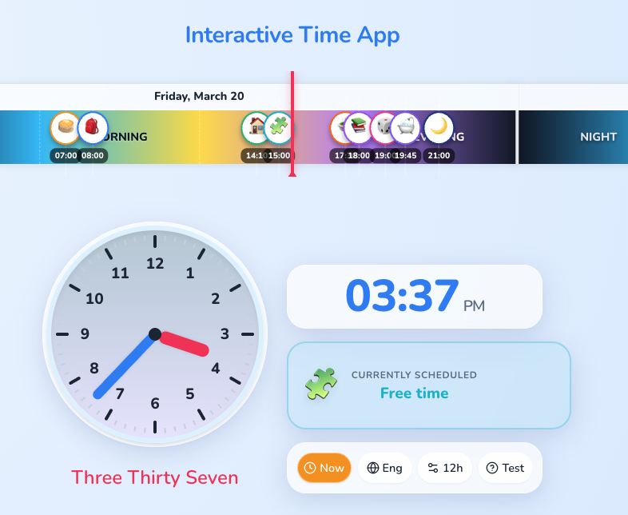

# Interactive Time App 🕰️

An interactive, educational clock and daily routine application built with **React**, **TypeScript**, and **Vite**. This application is designed to help children visualize time, understand daily schedules, and practice telling time in both Russian and English.



## Features

- **Interactive Analog & Digital Clocks**: Watch the time pass or control it manually.
- **Daily Routine Widget**: Displays the current scheduled activity with colorful UI and emojis.
- **Bilingual Interface**: Seamlessly switch between **Russian** (`ru`) and **English** (`en`) for both the UI and the written representation of the time.
- **Dynamic Gradients**: The analog clock face changes gradients based on the time of the day (Sunrise, Daytime, Sunset, Night) to simulate the sun.
- **Test Mode**: Generates a random time so users can practice reading the clock before evaluating the correct written text.
- **Beautiful & Modern UI**: Incorporates smooth layout animations powered by Framer Motion, a calendar strip, and a glassmorphic aesthetic optimized for desktop and mobile.

## Tech Stack

- **Framework**: [React 18](https://react.dev/) + [Vite](https://vitejs.dev/)
- **Language**: [TypeScript](https://www.typescriptlang.org/)
- **Animations**: [Framer Motion](https://www.framer.com/motion/)
- **Linting & Security**: ESLint + TruffleHog (pre-commit hook)

## Getting Started

1. Install dependencies:
   ```bash
   npm install
   ```

2. Start the development server:
   ```bash
   npm run dev
   ```

3. Open your browser and navigate to the local URL provided (usually `http://localhost:5173`).

## Current Daily Routine

The application reflects the following daily breakdown:

- **07:00** — 🥞 Breakfast / Завтрак
- **08:00** — 🎒 School / Школа
- **14:10** — 🏠 Go Home / Домой
- **15:00** — 🧩 Free Time / Свободное время
- **17:30** — 🍲 Dinner / Ужин
- **18:00** — 📚 Homework / Домашнее задание
- **19:00** — 🎲 Game Time / Время для игр
- **19:45** — 🛁 Get ready for bed / Подготовка ко сну
- **21:00** — 🌙 Sleep / Сон

---
*Created as part of a personalized React learning and productivity toolset.*
